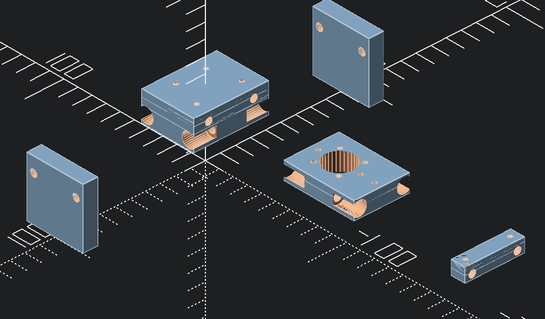
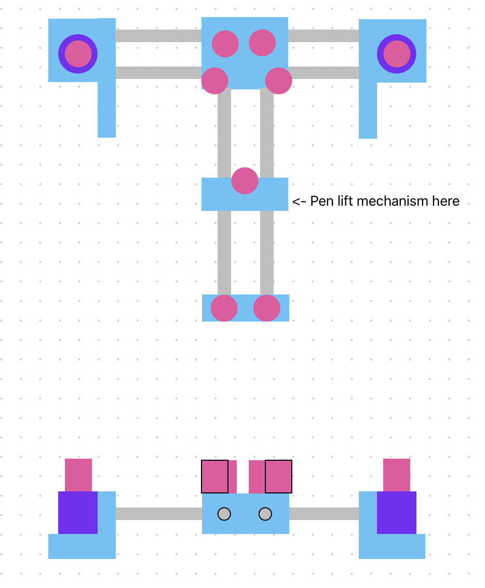
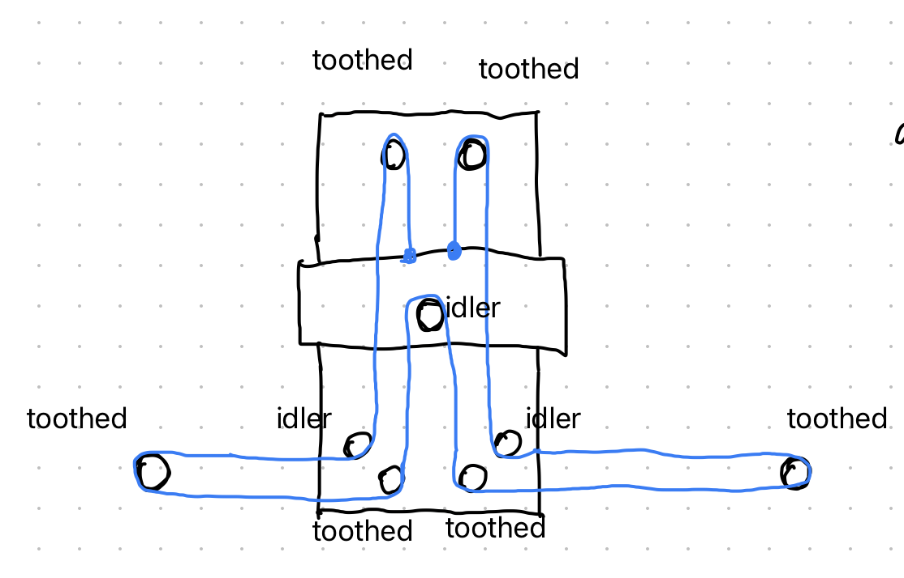

# pen plotter in openSCAD

This is a "T" style differential drive XY gantry, similar in concept to the coreXY layout.

## WIP render of model

# TODO
- The side stands need feet or outriggers to counter-balance the weight of the Y axis.
- The side stands need stepper motor mounts. Ideally modular for swapping different sizes of stepper motors.
- The pulley locations are *approximate* and *need* to be finalized. (This may result in some other geometry changes as their mounting holes interfere with the linear bearings or axis rods.)
- The pen lift mechanism has not been designed. The Y axis carriage is designed to accept different pen lift mechanisms as I suspect these will vary depending on the actual pen used.
- The maximum extents of the pen plotter should be calculated in openSCAD and reported to the user on render to ensure paremter changes result in a useful print area.
- There is no wiring diagram yet, although this will be relatively trivial. The stepper motors are driven by EasyDrivers or similar connected to an Arduino or Raspberry Pi.
- There is no software configuration yet. There are several existing, well-documented differential drive pen plotter projects to take inspiration from.

# Parts required
- four 5mm diameter ~200mm long stainless steel rods
- eight LM5UU linear bearings
- toothed belt - I am using 2mm pitch, 6mm wide GT2, but all pulleys are printed and therefore you can print to match whatever timing belt you have on-hand
- two NEMA-17 stepper motors
- electronics to drive and control the stepper motors
  - BigEasy drivers, etc
  - Arduino, Raspberry Pi, etc
- power supply

# Customizing
The `scad/common.scad` file contains the highest level parameters for the plotter. You should be able to modify parameters there to adjust to the parts you have on-hand and your own 3D printer tolerances. For example, you could redefine the diameter of the stainless steel rods or use different linear bearings.

# Images
## Early sketch of the printer layout

## Sketch of the belt path

